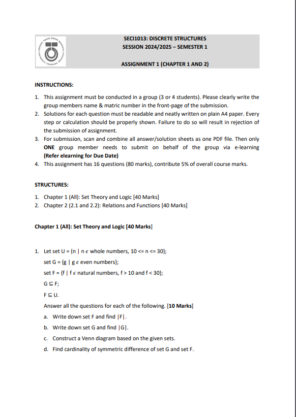
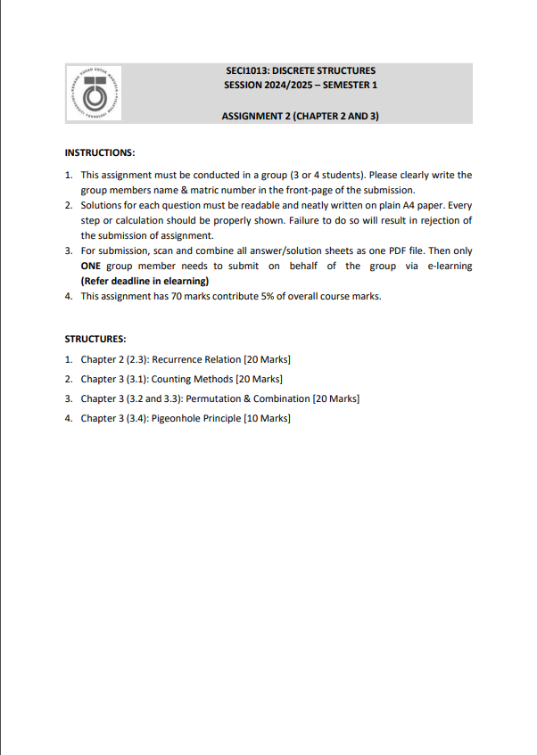
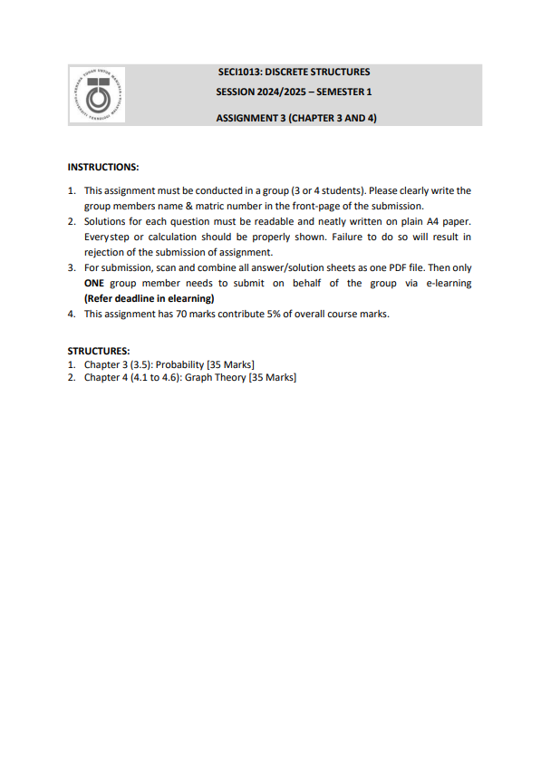
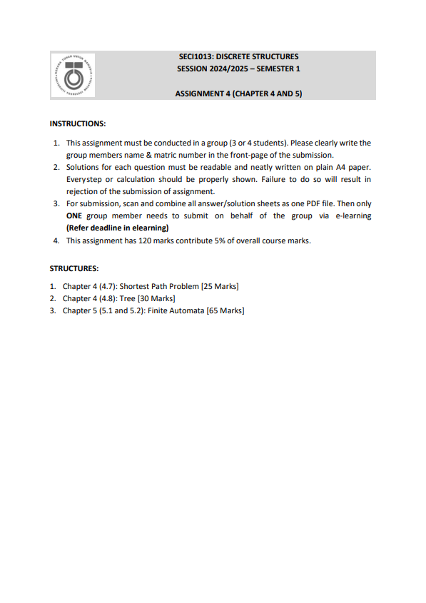

# ♾️ SECI 1013 Discrete Structure
## ❓ Synopsis
This course introduces students to the principles and applications of discrete structure in the
field of computer science. The topics that are covered in this course are set theory, proof
techniques, relations, functions, recurrence relations, counting methods, graph theory, trees
and finite automata. At the end of the course, the students should be able to use set theory,
relations and functions to solve computer science problems, analyze and solve problems using
recurrence relations and counting methods, apply graph theory and trees in real world problems
and use deterministic finite automata finite state machines to model electronic devices and
problems.

## ➕ Assignment 1
1️⃣ This assignment covered chapter 1 (Set Theory) and chapter 2 (Relations & Functions).   
📝 Worksheet :   

  🧩 Solution: [Assignment 1](https://github.com/XinYing0905/discreteStructure/blob/main/Assignments/ASSIGNMENT%201%20DISCRETE%20STRUCTURE.pdf)
- 💭 Reflection:
> This assignment motivated me to revise Chapters 1 and 2, serving as a tool to evaluate my understanding of these topics. As a group assignment, it also marked the beginning of collaboration with my group members.

## ➖ Assignment 2
2️⃣ This assignment covered chapter 2 (Relations & Functions) and Chapter 3 (Counting Methods & Probability).  
📝 Worksheet :   

  🧩 Solution: [Assignment 2](https://github.com/XinYing0905/discreteStructure/blob/main/Assignments/ASSIGNMENT%201%20DISCRETE%20STRUCTURE.pdf)
- 💭 Reflection:
> This assignment further enhanced engagement among group members. This was because several questions related to probability were quite confusing. Within our group, we all had different perspectives on the questions, which encouraged discussion and collaboration.

## ✖️ Assignment 3
3️⃣ This assignment covered chapter 3 (Counting Methods & Probability) and  chapter 4 (Graph Theory).   
📝 Worksheet :   

  🧩 Solution: [Assignment 3](https://github.com/XinYing0905/discreteStructure/blob/main/Assignments/DS%20ASSIGNMENT%203%20G7.pdf)
- 💭 Reflection:
> This assignment boosted my understanding on these topics, as there were some extreeeemely hard questions required me to do extra researches and consultation. Yeah probability question 5, I'm referring to youuuuuu! 

## ➗ Assignment 4
4️⃣ This assignment covered chapter 4 (Graph Theory) and chapter 5 (Finite Automata).  
📝 Worksheet :   

  🧩 Solution: [Assignment 4](https://github.com/XinYing0905/discreteStructure/blob/main/Assignments/DS%20A4.pdf)
- 💭 Reflection:
> This is the last assignment of the semester, so we all treated it very seriously, checked and checked before submitting. Hopefully our hardwork can be paid off hahahaha.

## 🪞 Reflection
This course is kind of like extension to mathematics I've learned during high school. I gained deeper understanding on topics like functions, probability and graphs now.
